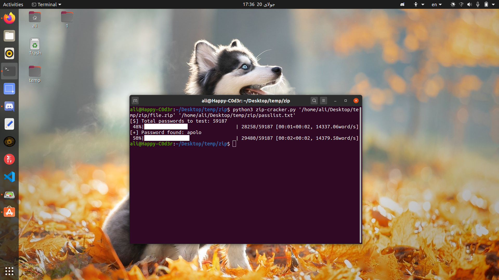

# zip-cracker

python zip cracker

#### Warning
This script is only for learning purpose.
Never use it to break the law.

## Table of Contents
* [Installing](https://github.com/ali-moments/zip-cracker#installing)
* [Usage](https://github.com/ali-moments/zip-cracker#usage)
* [ScreenShot](https://github.com/ali-moments/zip-cracker#screenshot)
* [Credits](https://github.com/ali-moments/zip-cracker#credits)
* [License](https://github.com/ali-moments/zip-cracker#license)

## Installing
```bash
git clone https://github.com/ali-moments/zip-cracker.git
cd zip-cracker
pip install -r requirements.txt
python zip-cracker.py
```

## Usage
for useing this script you can run script with `python zip-cracker.py` command! <br>
in the other hand you can run it with `python zip-cracker.py [path of zipfile] [path of password list]` command

## ScreenShot



